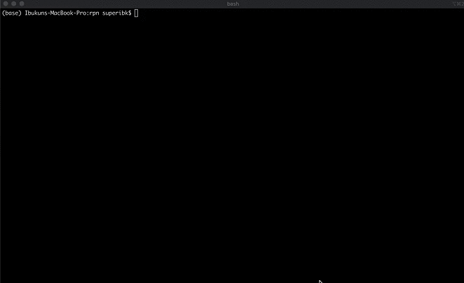

# Reverse Polish Notation Calculator

## Installation 
* Unzipped the rpn.zip file 
* Run the command './install.sh' from the root directory of the rpn folder .

  Alternatively, you can run the command ' pip install . ' from the root directory ([install pip if you don't already have it](https://github.com/pypa/pip))   .

  

* Run 'rpn' from your command line(terminal) interface

* To Uninstall run "pip uninstall rpn"

